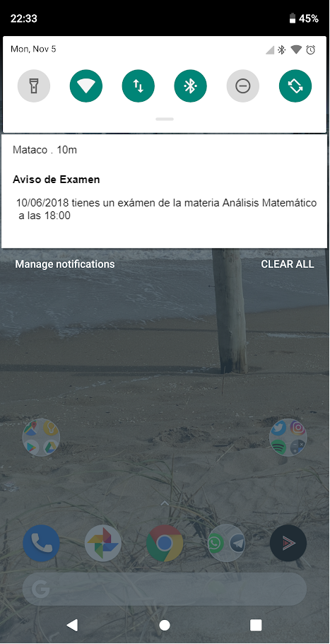

# HU23: Como alumno recibir una notificación cuando el reloj de mi dispositivo marca que faltan 48 horas para que comience un examen al que me inscribí.

## Criterios de aceptación
- Dado que un alumno se inscribió a un examen y que faltan 48 horas para el comienzo de ese examen según el reloj del dispositivo, recibirá una notificación. 

## Prototipo

