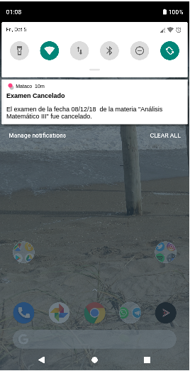

# HU26: Como alumno recibir una notificación cuando se cancela un examen al que me inscribí.

## Criterios de aceptación
- Dado que un alumno se inscribió a un examen, cuando ese examen es cancelado recibirá una notificación. 

## Prototipo

