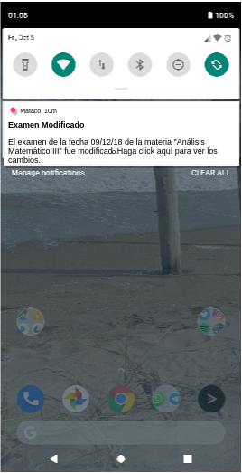

# HU27: Como estudiante recibir una notificación cuando se modifica un examen al que me inscribí.

## Criterios de aceptación
- Dado que un estudiante se inscribió a un examen, cuando ese examen es modificado por parte del docente (cambia el aula o el horario), recibirá una notificación. 

## Prototipo

