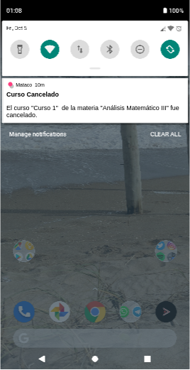

# HU30: Como estudiante quiero recibir una notificación cuando se elimina un curso al que me inscribí

## Criterios de aceptación
1. Cuando un administrador de departamento elimina un curso según lo definido en HU02, todos los estudiantes inscriptos recibirán una notificación en su celular que informa el nombre del curso, y/o el nombre de la materia, y el hecho de que el curso fue eliminado.

## Prototipo

