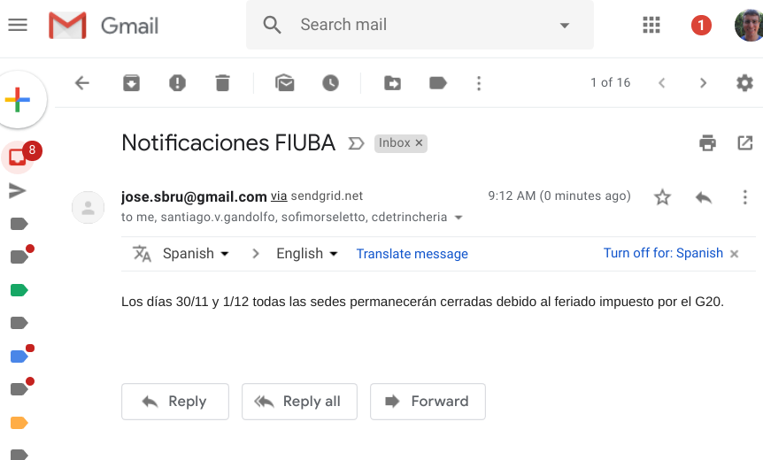

# HU43: Como docente quiero recibir notificaciones por mail

1. El asunto del mail será "Notificaciones FIUBA"
2. El cuerpo del mail consta del contenido enviado según HU42, que es unicamente texto plano.
3. En el remitente figurará una dirección de mail **a determinar**.

