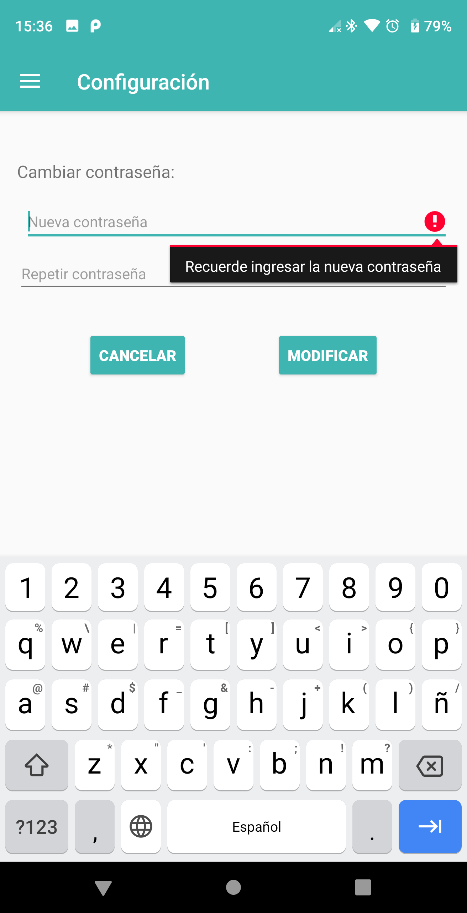
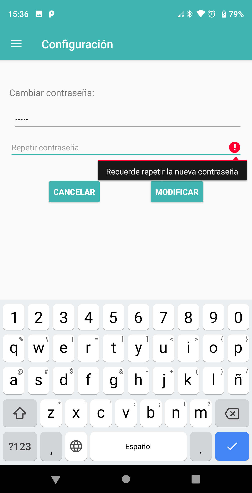
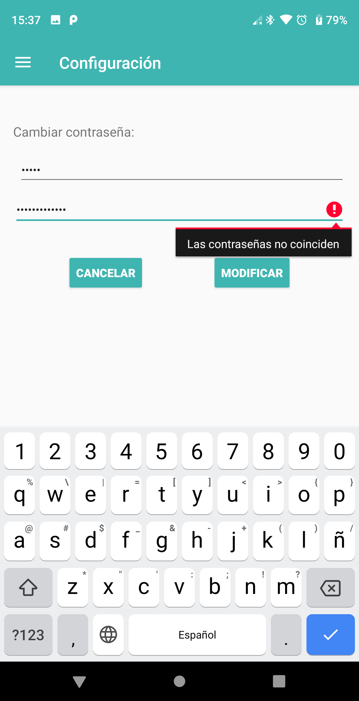

# HU45: Como estudiante, quiero modificar mi contraseña

## Criterios de aceptación
- El estudiante puede modificar su contraseña ingresando desde el menú lateral a la opción "Configuración".
- La contraseña ingresada debe ser diferente de la contraseña original.
- La contraseña ingresada no puede estar vacía.
- Se debe verificar la contraseña ingresada, repitiéndola.
- Puede cancelar el cambio, para lo cual será redirigido a la pantalla principal (Oferta académica)
- En caso de que el estudiante se haya olvidado su contraseña, tendrá que ir al área de alumnos de la facultad para que le den una provisoria.

## Prototipo

