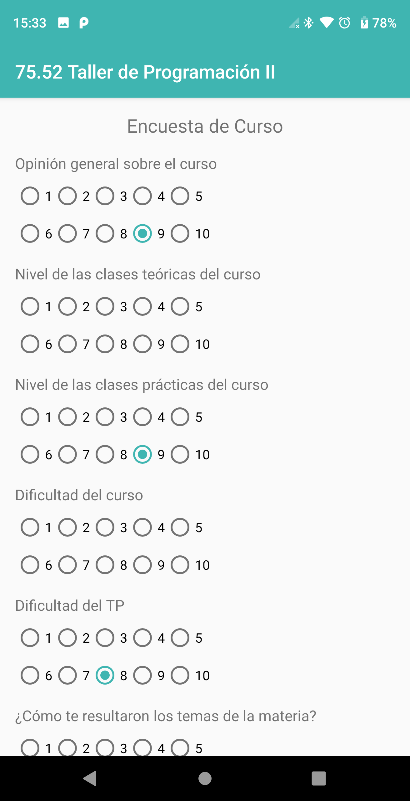
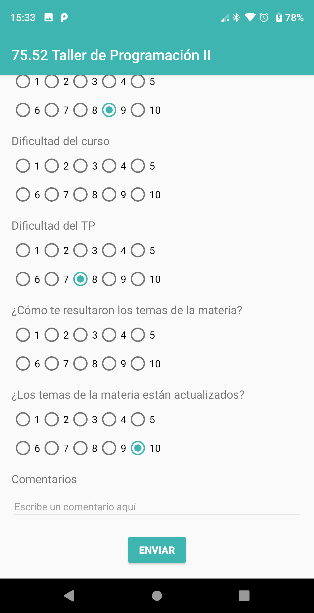

# HU46: Como estudiante, quiero completar encuestas

## Criterios de aceptación
- Al estudiante se le mostrará una pantalla con un listado de cursos para los cuales aprobó la materia pero no completó la encuesta
- Un estudiante puede completar la encuesta correspondiente a una cursada únicamente si tiene una nota de cursada y se encuentra aprobada. Esto implica que las encuestas podrán realizarse inmediatamente después de que al estudiante se le asigne una nota de cursada.
- La misma debe presentar los siguientes ítems, los cuales se responden con un puntaje de 1 a 10:
    - Opinión General Sobre el Curso
    - ¿Cómo te Resultaron los Temas de la Materia?
    - ¿Los Temas de la Materia Están Actualizados?
    - Nivel de las Clases Teóricas del Curso
    - Nivel de las Clases Prácticas del Curso
    - Dificultad del Curso
    - Dificultad del TP
- Al final de la encuesta podrá completar un campo de texto libre para realizar algún comentario sobre el curso.
- Puede enviar la encuesta sin haber escrito en el campo de texto libre.
- No puede enviar la encuesta sin haber completado todos los ítems de selección. En ese caso, se le marcará el primer ítem que no fue completado.
- Los ítems de selección serán números del 1 al 10
- Una vez enviada la encuesta, se volverá a la pantalla con el listado de cursos para los cuales debe completar la encuesta
- Una vez completada la encuesta, la materia dejará de aparecer en el listado
- Si no hay cursos en el listado, se le será indicado

## Prototipo

