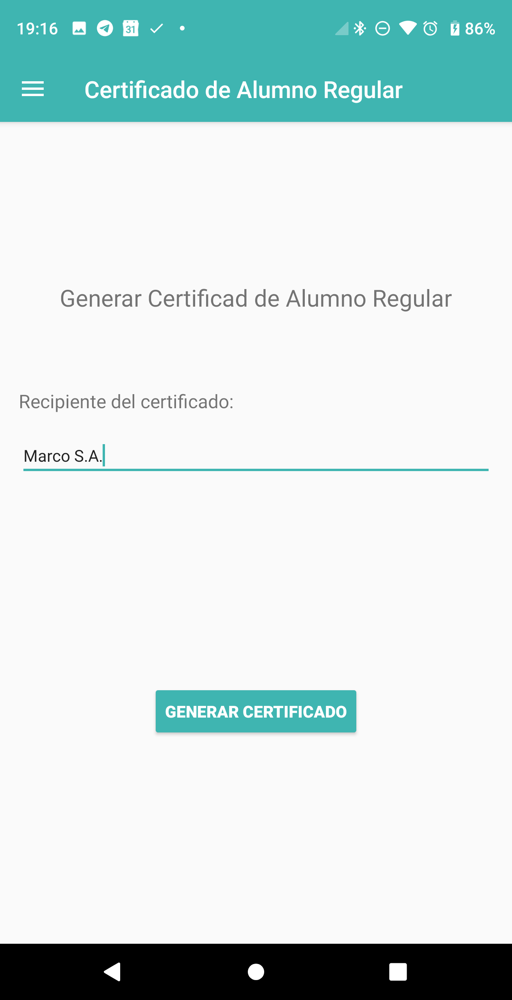
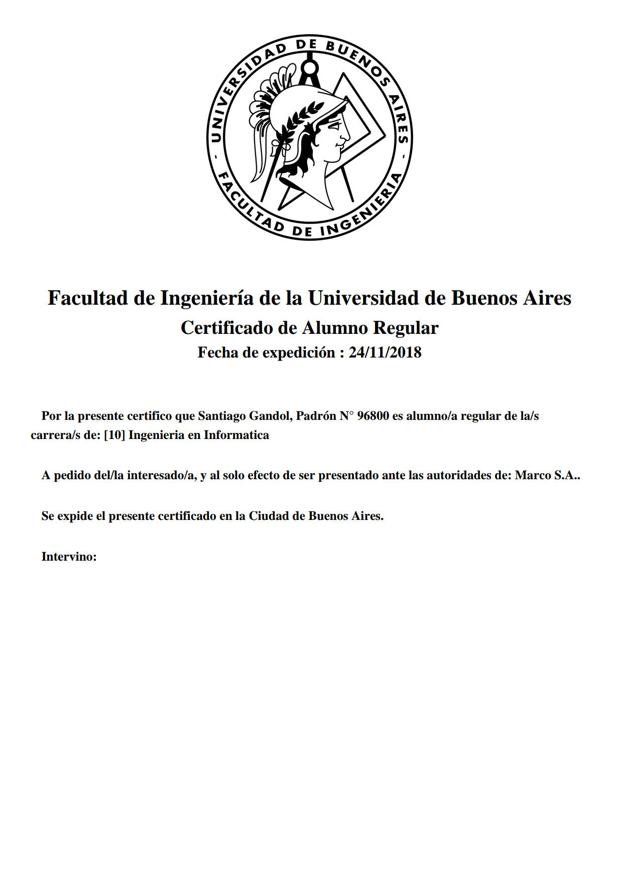

# HU47: Como estudiante, quiero descargar certificado de alumno regular

## Criterios de aceptación
- Deberá presentarse una pantalla en donde el estudiante pueda ingresar la autoridad para la cual está dirigido el certificado
    - El certificado deberá presentar:
    - Nombre y Apellido del estudiante
    - Padrón del estudiante
    - Fecha en la cual se emitió el certificado
    - Carreras del estudiante
- El certificado será descargado como archivo .pdf tamaño A4

## Prototipo

