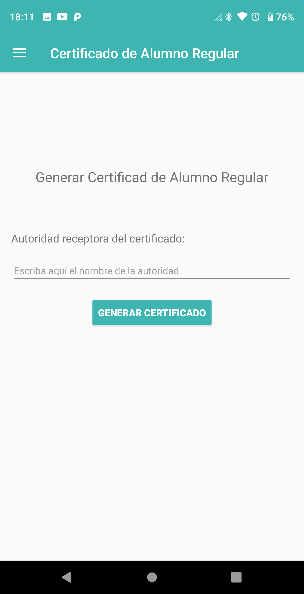
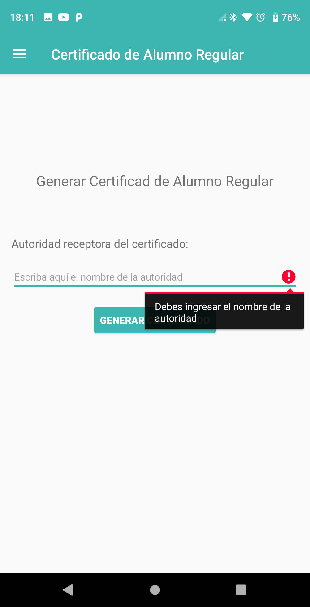
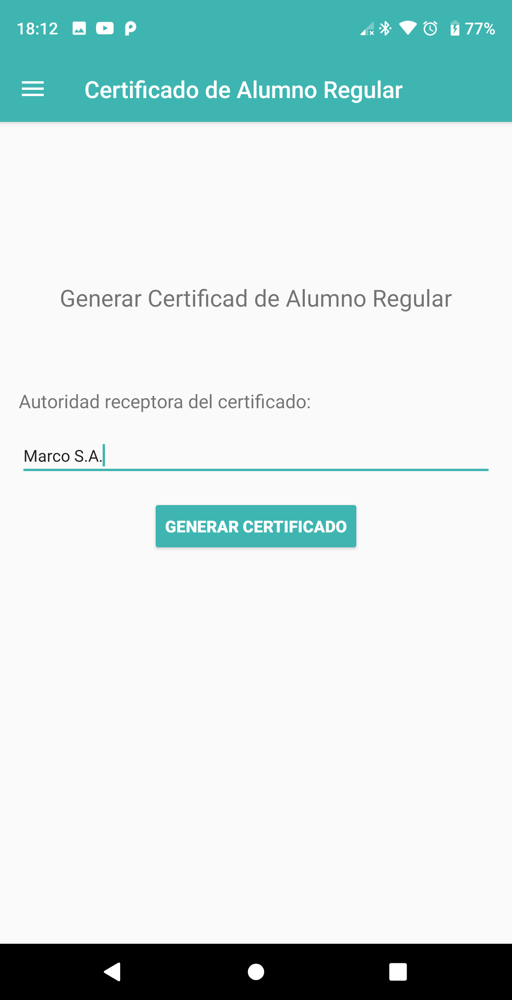

# HU47: Como estudiante, quiero descargar certificado de alumno regular

## Criterios de aceptación
- Deberá presentarse una pantalla en donde el estudiante pueda ingresar la autoridad para la cual está dirigido el certificado
- El certificado deberá presentar:
    - Nombre y Apellido del estudiante
    - Padrón del estudiante
    - Fecha en la cual se emitió el certificado
    - Carreras del estudiante
    - Autoridad para la cual está dirigido el certificado
- El certificado será descargado como archivo .pdf tamaño A4, con el formato "regular_[día][mes][año].pdf" para el nombre, por ejemplo "regular_20112018.pdf". En caso de haber otro archivo con el mismo nombre lo sobreescribe.
- El certificado será descargado en la carpeta “Downloads” presente por default en el celular. Una vez creado el documento, se abre la aplicación de lectura de pdf del celular para poder verlo. En caso contrario se le mostrará un mensaje diciendo que no se pudo generar el comprobante.

## Prototipo

