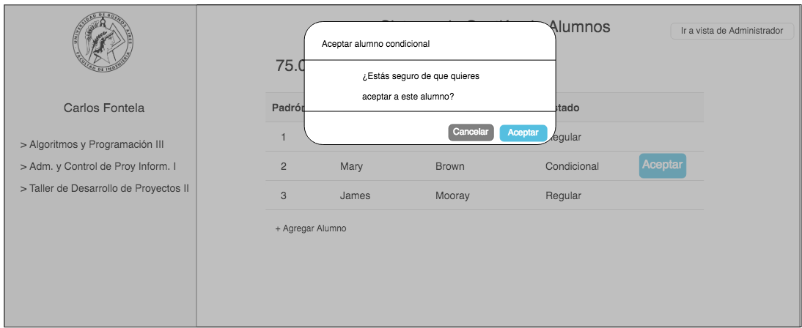

# HU8: Como docente quiero poder aceptar alumnos condicionales a mi curso

## Criterios de aceptación

1. Dado un docente que visualizó el listado de alumnos inscriptos a uno de sus cursos cuando se muestren los alumnos inscriptos condicionales entonces ~~figurará al lado de los datos del alumno un botón para aceptarlo al curso~~ *podrá aceptarlos en el curso*.

2. Dado un docente que visualizó el listado de alumnos inscriptos a uno de sus cursos cuando este ~~presione el botón para~~ *decida* aceptar un alumno condicional entonces se mostrará un modal para que el profesor confirme esta acción.

3. Dado un docente que aceptó un alumno condicional cuando el profesor confirme la acción entonces el alumno pasará a ser alumno regular del curso.

4. *El profesor no puede desinscribir alumnos ya aceptados*

## Prototipo

