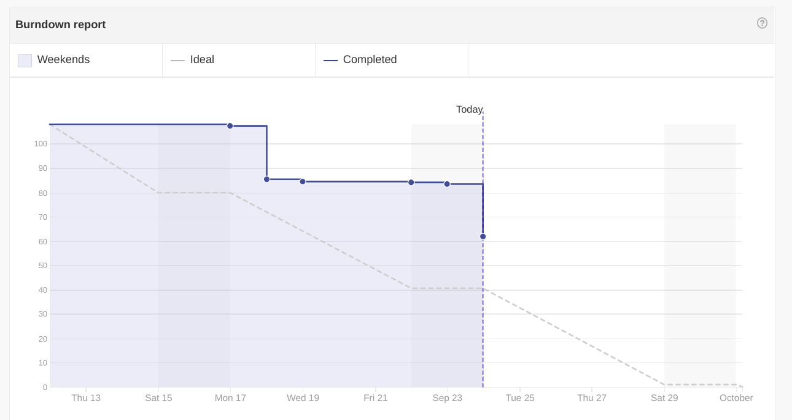
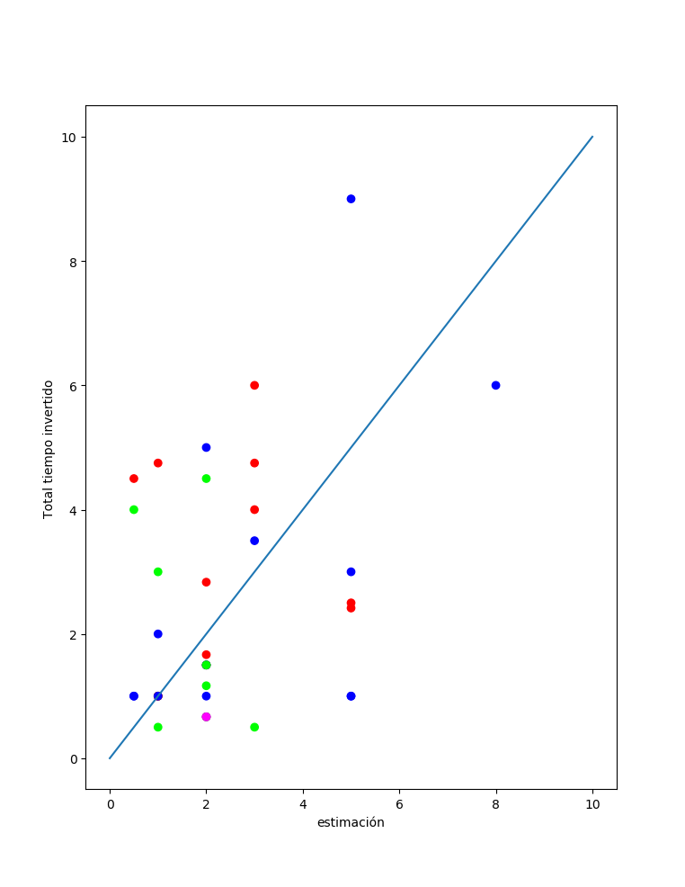
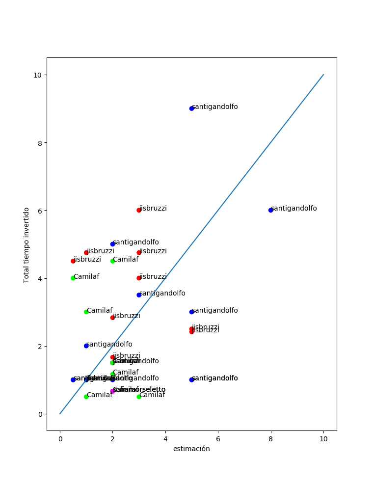
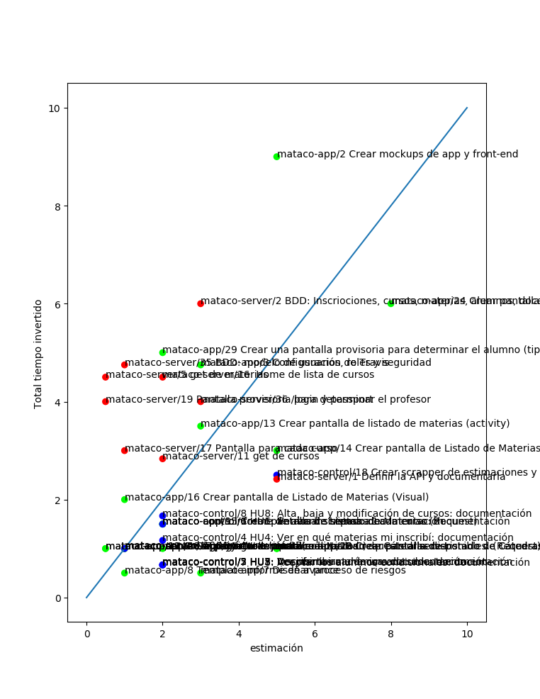
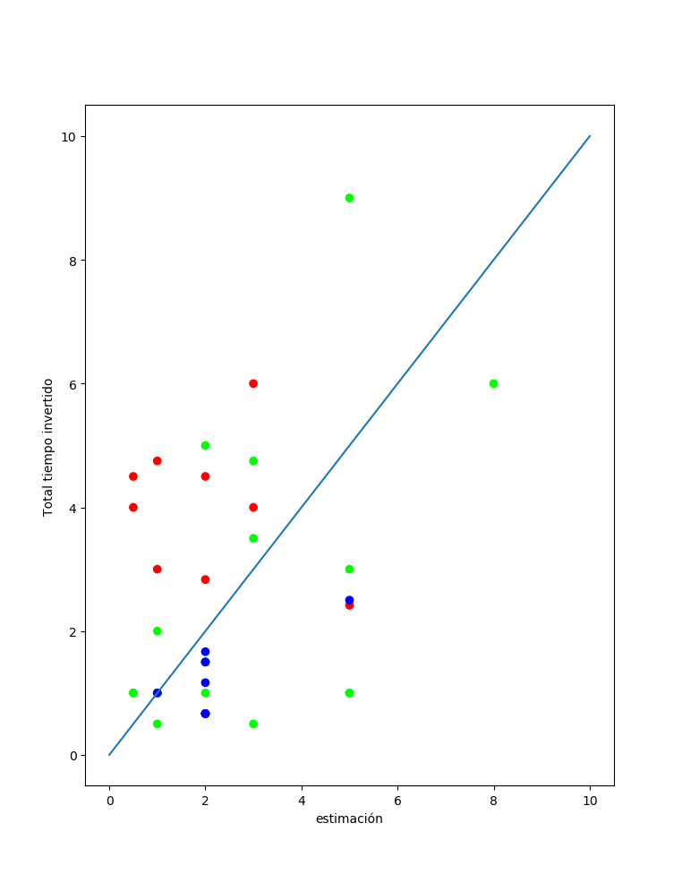
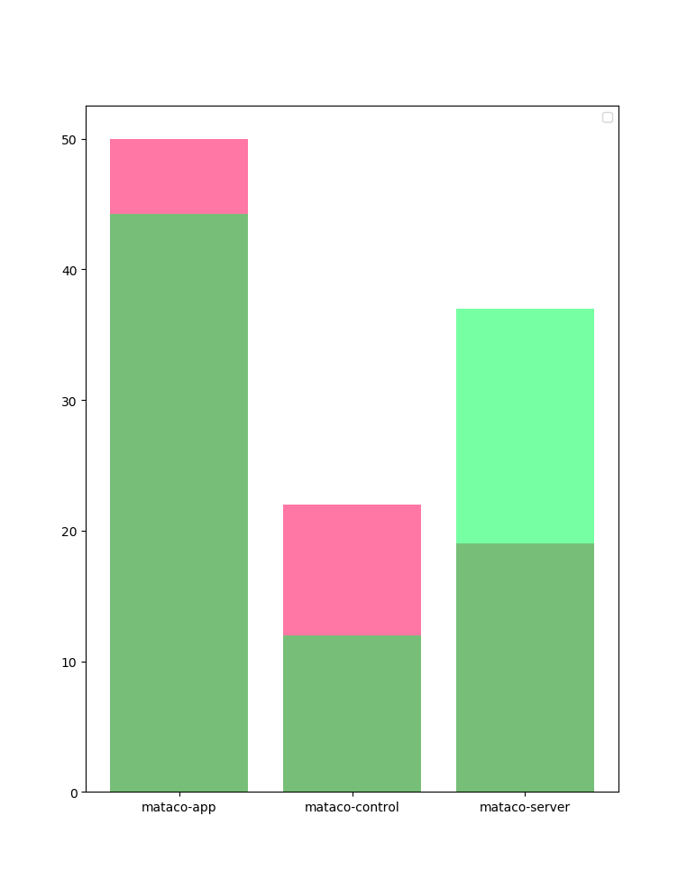
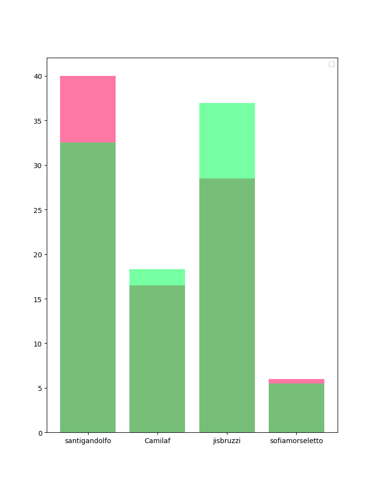

# Matacos: Reporte de avances 34/9/2018 (iteración 1, reunión informal 2)

 - **Proyecto**: Mataco: Sistema de Gestión Académica
 - **Product Owner**: Alejandro Molinari
 - **Scrum Master**: Sofía Morseletto
 - **Iteración**: 1
 - **Fecha**: 24/09/2018
 - **Período informado**: 17/09 - 24/09
 - **Tipo de reunión**: informal
 - **Equipo 1**:
    - Camila de Trincheria
    - José Sbruzzi
    - Santiago Gandolfo
    - Sofía Morseletto
## Avances:
### Especificaciones
 - Se construyeron 8 epics junto con prototipos, que se enviaron al product owner para su validación. No fueron validadas.
 - Se construyó un programa que descarga la información de tiempos estimados e invertidos en cada issue.
 - Se construyó un programa que permite visualizar esta información.
### Servidor
 - Desarrollado el pipeline de integración contínua.
 - Se agregaron usuarios y roles
 - Se crearon las tablas de materias y cursos, junto con los endpoint GET correspondientes.
 - Se llenaron las tablas de materias.
 - Se desarrollaron casos de prueba que verifican que se mantengan en funcionamiento tales endpoint.
 - Se agregó un front-end con React y Bootstrap que permite identificarse en el sistema, según el modelo de roles y usuarios.
### Cliente android
 - Se agregó la pantalla de Login
 - Se agregó una pantalla que muestra las materias a las que puede inscribirse el usuario loggeado.
 - Se agregó una pantalla que muestra los cursos de una materia.

## Riesgos
 - **Retrabajo consecuencia de que la visión del equipo no coincida con las expectativas del product owner.** Paleativos: trabajo extra durante la semana pasada. Probabilidad: media. Impacto: alto.
 - Disconformidad del cliente debido a la poca visibilidad del esfuerzo del equipo. Paleativos: Esfuerzo extra en la obtención y visualización de los datos de tiempo invertido. Probabilidad: baja. Impacto: medio.

## Compromisos
 - Terminar lo solicitado para el sprint:
    - **Mobile**: 
        - Inscribirse a una materia
        - Mostrar las inscripciones
    - **Front end**: 
        - ABM de cursos (administrador de departamento)
        - Aceptar condicionales
    - **Back end**:
        - ABM de inscripciones (alumnos y profesores)
        - ABM de cursos (departamentos)
## Métricas
### Burndown report

## Métricas
### Esfuerzo vs estimación por persona

### Esfuerzo vs estimación por persona con labels

### Esfuerzo vs estimación por repo

### Esfuerzo vs estimación por repo con labels

### Totales y estimaciones por repo (verde: realidad, rojo: estimación)

### Totales y estimaciones por persona (verde: realidad, rojo: estimación)

